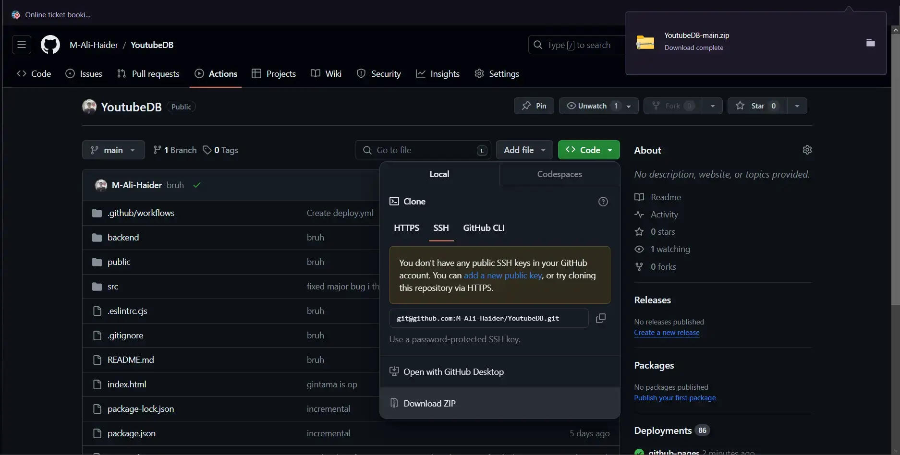
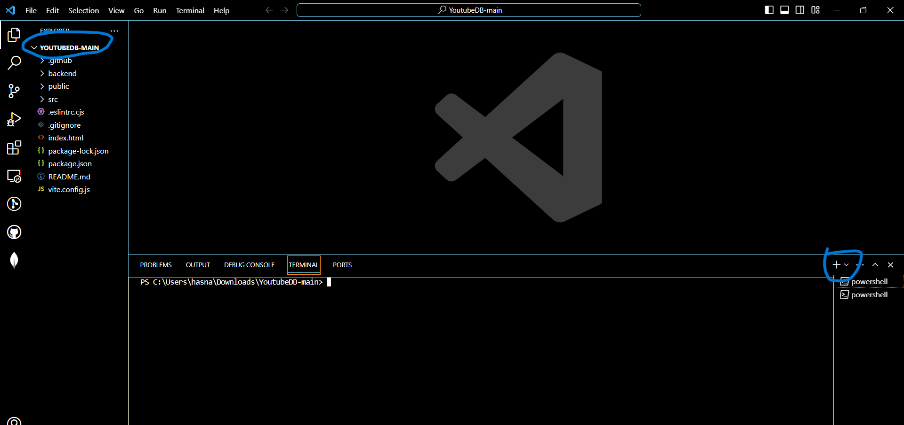
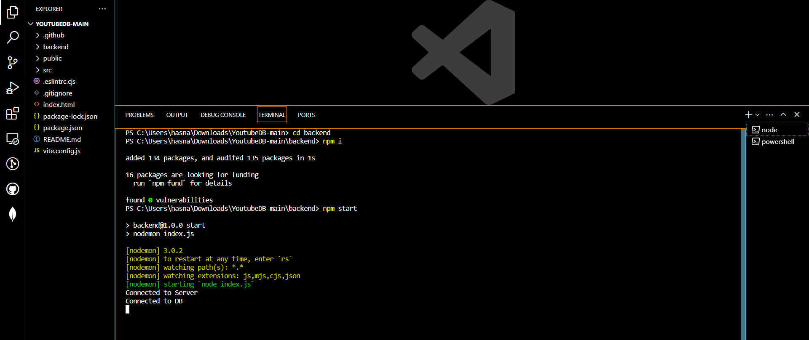
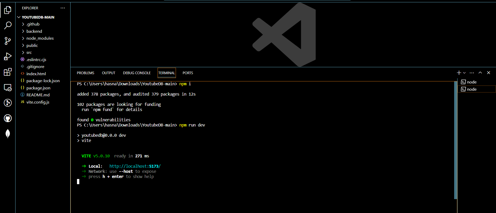

# YoutubeDB Project Setup

Note: Have Node.js installed [https://nodejs.org/en], You can verify if its installed by typing: 
```
'node -v'
```
command in cmd

Follow these steps to set up and run the YoutubeDB project locally:

1. **Download Zip File:**
   - Download the project zip file from [https://github.com/M-Ali-Haider/YoutubeDB](https://github.com/M-Ali-Haider/YoutubeDB)
   

2. **Extract and Open via IDE:**
   - Extract the downloaded zip file and open the project in your preferred Integrated Development Environment (IDE).

3. **Open Two Separate Terminals:**
   - Open two separate terminals in the IDE. (For VS Code, use the shortcut `CTRL +\``)
    

4. **Run Commands in the First Terminal (Backend):**
   - Navigate to the `backend` directory:
     ```
     cd backend
     ```
   - Install dependencies:
     ```
     npm i
     ```
   - Start the backend server:
     ```
     npm start
     ```
     

5. **Run Commands in the Second Terminal (Frontend):**
   - Install frontend dependencies:
     ```
     npm i
     ```
   - Start the frontend development server:
     ```
     npm run dev
     ```
     

6. **Access Localhost:**
   - Once the servers are running, find the localhost link and open it in your web browser.
   - Enjoy exploring the YoutubeDB project!

## Note
If you encounter any issues or need visual guidance, refer to the images provided in the repository.

# React + Vite Template

This template provides a minimal setup to get React working in Vite with HMR and some ESLint rules. Two official plugins are available:

- [@vitejs/plugin-react](https://github.com/vitejs/vite-plugin-react/blob/main/packages/plugin-react/README.md) uses [Babel](https://babeljs.io/) for Fast Refresh.
- [@vitejs/plugin-react-swc](https://github.com/vitejs/vite-plugin-react-swc) uses [SWC](https://swc.rs/) for Fast Refresh.
